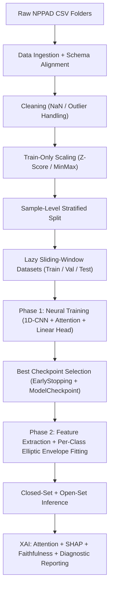
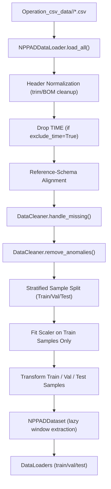
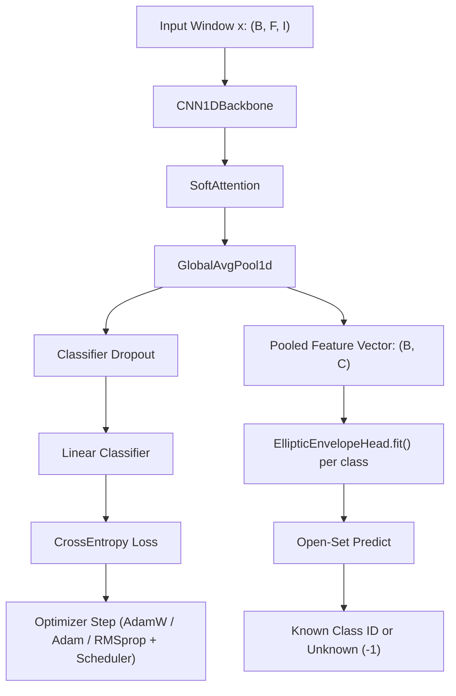
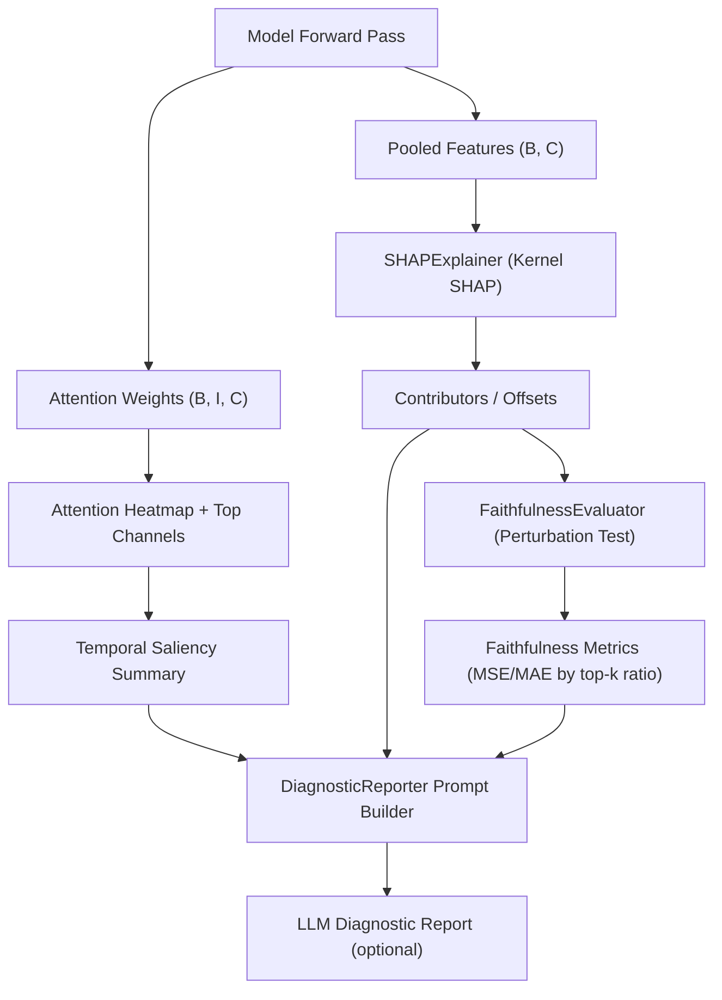
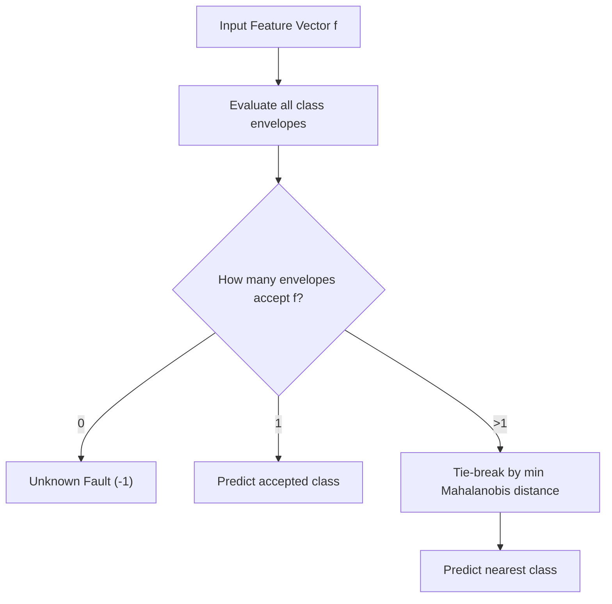

# Attn-1DCNN-EE Pipelines

## 1) End-to-End System Pipeline

## 2) Data Ingestion and Preprocessing Pipeline

## 3) Model Training and Inference Pipeline (with EE)

## 4) XAI and Reporting Pipeline

## 5) Open-Set Decision Logic (EE)

## 6) Complete End-to-End Pipeline (Unified)

```mermaid
flowchart LR
    subgraph D0["Data Source Layer"]
        A0["Operation_csv_data/<AccidentType>/*.csv"]
    end

    subgraph D1["Ingestion + Validation Layer"]
        A1["Read CSVs + Parse Labels"]
        A2["Header Cleanup (BOM/trim)"]
        A3["Reference-Schema Alignment (common 96 features)"]
        A4["TIME drop (optional)"]
    end

    subgraph D2["Preprocessing Layer"]
        B1["Missing-Value Handling"]
        B2["Outlier Handling"]
        B3["Sample-Level Stratified Split (Train/Val/Test)"]
        B4["Fit Scaler on Train Only"]
        B5["Transform Val/Test with Train Stats"]
    end

    subgraph D3["Windowing + Loader Layer"]
        C1["Lazy Sliding Window Extraction (N, I, F)"]
        C2["NPPADDataset objects"]
        C3["DataLoaders (batch, shuffle, workers, pin_memory)"]
    end

    subgraph D4["Phase 1: Neural Training"]
        M1["Input Window x: (B, F, I)"]
        M2["CNN1DBackbone"]
        M3["SoftAttention"]
        M4["GlobalAvgPool1d"]
        M5["Dropout + Linear Head"]
        M6["CrossEntropy Loss (+ class weights/focal if enabled)"]
        M7["Optimizer + LR Scheduler + Grad Clipping"]
        M8["Validation Monitoring (val_loss / macro-F1)"]
        M9["Best Checkpoint (EarlyStopping + ModelCheckpoint)"]
    end

    subgraph D5["Phase 2: EE Open-Set Fitting"]
        E1["Extract pooled train features from best checkpoint"]
        E2["Fit per-class EllipticEnvelope (FastMCD)"]
        E3["Store envelope center/covariance/threshold"]
    end

    subgraph D6["Inference + Decision Layer"]
        I1["Incoming window"]
        I2["Backbone + Attention + Pooling features"]
        I3["Linear head logits (closed-set)"]
        I4["EE accept/reject across classes"]
        I5{"Accepted envelopes?"}
        I6["0 => Unknown (-1)"]
        I7["1 => accepted class"]
        I8[">1 => nearest Mahalanobis class"]
        I9["Final Prediction"]
    end

    subgraph D7["Evaluation + XAI Layer"]
        X1["Metrics: accuracy, macro/weighted F1, per-class report"]
        X2["Confusion Matrix"]
        X3["Attention Heatmaps / Channel Importance"]
        X4["SHAP contributions on pooled features"]
        X5["Faithfulness / perturbation checks"]
        X6["Diagnostic report artifact (optional LLM summary)"]
    end

    A0 --> A1 --> A2 --> A3 --> A4
    A4 --> B1 --> B2 --> B3 --> B4 --> B5
    B5 --> C1 --> C2 --> C3
    C3 --> M1 --> M2 --> M3 --> M4 --> M5 --> M6 --> M7 --> M8 --> M9
    M9 --> E1 --> E2 --> E3

    I1 --> I2
    I2 --> I3
    I2 --> I4
    E3 --> I4
    I4 --> I5
    I5 --> I6 --> I9
    I5 --> I7 --> I9
    I5 --> I8 --> I9

    I9 --> X1
    I9 --> X2
    I2 --> X3
    I2 --> X4 --> X5
    X1 --> X6
    X2 --> X6
    X3 --> X6
    X5 --> X6
```

